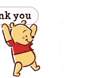

```{r setup, include=FALSE}
options(htmltools.dir.version = FALSE)
knitr::opts_chunk$set(eval=TRUE, 
        echo=FALSE, message=FALSE, warning=FALSE
        )
library(meetupr)
library(tidyverse)
library(lubridate)
library(tidyquant)
library(tidytext)
library(wordcloud)
theme_set(theme_tq())
```

```{r xaringan-themer, include=FALSE, warning=FALSE}
library(xaringanthemer)

style_mono_accent(
    base_color           = "#09017F",
    header_font_google   = google_font("Roboto", "700"),
    text_font_google     = google_font("Roboto Condensed"),
    code_font_google     = google_font("Droid Mono") ,
    code_highlight_color = "#D2B6E8"
)

```

class: inverse, title-slide, center, bottom


background-image: url(images/Orchid-The-National-Flower-of-Kenya.jpg)
background-size: cover

# `r rmarkdown::metadata$title`

## `r rmarkdown::metadata$subtitle`

### `r rmarkdown::metadata$author` 

#### `r params$event` &#183; `r params$date`

---
name: hello
class: inverse, right, bottom

# Keep in touch...

[`r icon::fa("twitter")` @sciencificity](http://twitter.com/sciencificity)  

[`r icon::fa("twitter")` @RLadiesJozi](http://twitter.com/RLadiesJozi) 

[`r icon::fa("github")` @sciencificity](http://github.com/sciencificity)  

[`r icon::fa("paper-plane")` Vebashini](mailto:vebashini@gmail.com)

---

class: center, middle, inverse

## Firstly, congratulations on the launch!!!


---

## What's in a number?

```{r message=FALSE, include=FALSE}
st <- stamp("Tuesday, June 16, 1987")
events <- get_events("rladies-johannesburg", "past")
members <- get_members("rladies-johannesburg")

first_event <- 
  events %>% 
  select(time) %>% 
  head(1) %>% 
  mutate(test = ymd_hms(time, tz = "Africa/Johannesburg"),
         date_part = date(test),
         st_date = st(date_part))
  # mutate(meet_date = as.Date(ymd_hms(time, tz = "Africa/Johannesburg"))) 

attendees <-events %>% 
  summarise(total_attendees = sum(yes_rsvp_count),
            mean_attendees = mean(yes_rsvp_count),
            median_attendees = median(yes_rsvp_count))

```

- We have ``r nrow(members)`` members on our group.
- We held our first meetup on ``r first_event$st_date``, and to date we've held ``r nrow(events)`` events, with ``r attendees$total_attendees`` __Yes__ RSVP's `r emo::ji("smiley")`.

- We've had approximately ``r round(attendees$mean_attendees)`` `r emo::ji("dancing")` attendees per meetup, but in truth about $2/3$rd's of __Yes__ RSVP's actually pitch up, so more like ``r round(2/3*(attendees$mean_attendees))`` attendees per meetup `r emo::ji("grimacing")`.

- Truth be told, __online__ meetups are doing much better. We've held `4` meetups online and all have had more than 20 attendees! `r emo::ji("happy")` `r emo::ji("tada")`.


---

## If `R` be the food of love, code on `r emo::ji("heart")`
.pull-left[
```{r}
events %>% 
  mutate(date = date(ymd_hms(time, tz = "Africa/Johannesburg"))) %>% 
  ggplot(aes(x=date, y = yes_rsvp_count)) +
  geom_col() +
  coord_flip() +
  labs(x = '',
       y = 'Yes RSVPs',
       title = '`Yes RSVPs` over time @RLadiesJozi')
  
```
]

.pull-right[
Don't worry too much if your numbers stay low for a while, you're  building a community and that doesn't happen instantaneously!

For your peace of mind, my suggestion is to set an expectation of a number of attendees you'd be happy with `r emo::ji("hooray")`
]

---

## Logistics

- We have had monthly meetups - and try to have at least 10 a year.
- We have thus far, had only women speakers, with the exception of Colin Fay who spoke alongside Dr. Heather Turner.
- We would like to keep the speakers to women and minority genders as far as possible, the same goes for the leadership team.
- We set the stage at our very first meetup that we want R-Ladies Johannesburg to be a warm and welcoming environment for everyone.

---


## Get involved
_We know what we are, but know not what we may be ..._


- Sign up to be a curator [@WeAreRLadies](http://twitter.com/WeAreRLadies)   [here](https://github.com/rladies/starter-kit/tree/master/RoCur-Twitter)
- Watch the [@AfricaRUsers](http://twitter.com/AfricaRUsers) handle because we're going to launch an African R curatorship account soon.

- Give a talk (Feeling nervous? Yep, I do too - serious social anxiety, but you'll not find a more welcoming place than an R-Ladies meetup)! Plus chances are if you're really nervous you can get some mentorship from other community members who are more confident in this regard.

- Once normality resumes meetups will likely go back to being in person. Do you have contacts who can sponsor a `venue` or `catering budget`? 

---

## Highlights

- Exposure to a wider community of like minded `data nerds` `r emo::ji("grin")`.
- Build knowledge and expertise `r emo::ji("upward")`.
- Be invited to chair sessions at community events, speak at conferences, mentor.
- Make new lifelong friends.
- Collaborate on projects.
- Get a job!
- Discuss aspects like negotiating with potential employers, CV review, how to navigate certain conversations etc. in a safe space.
- __Dr Heather Turner__ who is one of the mentors for AfricaR has this [wonderful article](https://www.r-consortium.org/blog/2020/06/23/r-communities-in-south-africa) that is a must read.

---

## R-Ladies Johannesburg "Get Better At" wishlist

- We need to actively seek feedback - we're trying to build a diverse community but to do so we need to collect feedback from our community.
- We have not done a very good job about spreading the word on meetups and our organisation.
- Have women and minority genders approach us about speaking.

---

### Thanks for having me, and most of all Best of luck! `r emo::ji("luck")`

- The slide aesthetics is almost wholely copied from  [Alison Hill's beautiful ggplot slides](https://alison.netlify.app/rlm-sad-plot-better)
- The stats for the meetup is from the RLadies maintained [{meetupr} package](https://github.com/rladies/meetupr)





```{r, eval=FALSE}
tokens <- events %>% 
  unnest_tokens(word, description) %>% 
  count(word, sort=TRUE) %>% 
  ungroup() %>% 
  anti_join(stop_words, by = c("word" = "word"))

pal <- brewer.pal(8, 'Dark2')
tokens %>% 
  with(wordcloud(word, n, random.order=FALSE,
                 max.words=25, colors=pal))

```
